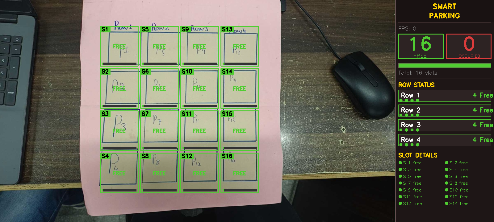
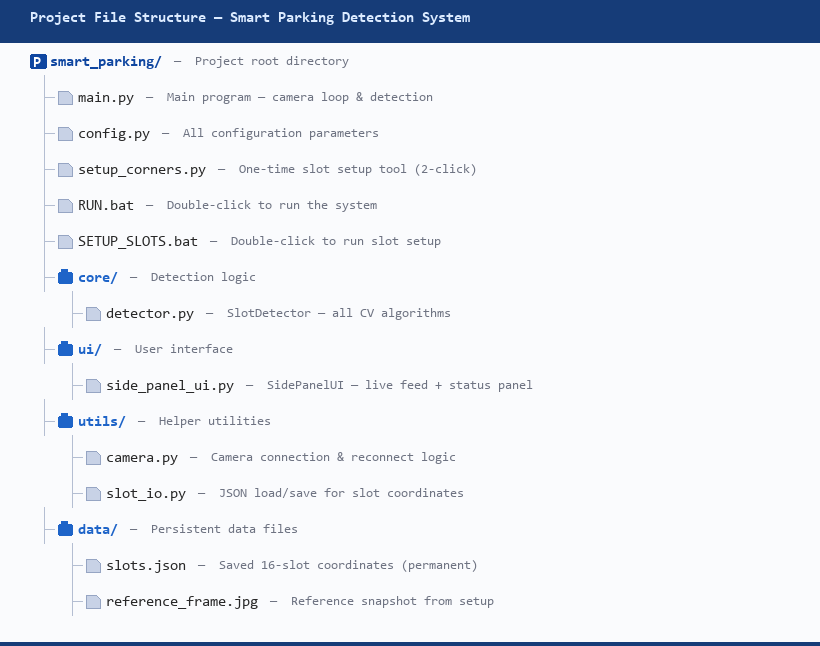

# Smart Parking System


A real-time computer vision project that detects parking slot occupancy using a camera feed or a static image. The system highlights each slot as free or occupied and presents a live dashboard with occupancy statistics.

## Overview

This project demonstrates how computer vision techniques can be applied to smart parking management. It combines OpenCV-based image processing with a lightweight graphical interface to identify occupied parking spaces in a parking lot.

## Key Features

- Live parking slot detection from camera input
- Static image mode for testing and demos
- Interactive slot mapping using corner selection
- Visual overlays for free and occupied slots
- Side-panel dashboard with occupancy summaries
- Adjustable sensitivity for different lighting conditions

## Project Preview

### Real Interface Screenshot



### Project Structure



## Technologies Used

- Python
- OpenCV
- NumPy
- imutils

## Installation

1. Clone the repository:

   ```bash
   git clone https://github.com/baharrajput/smart-parking-system.git
   cd smart-parking-system
   ```

2. Create and activate a virtual environment:

   On Windows:

   ```bash
   python -m venv .venv
   .venv\Scripts\activate
   ```

3. Install the required packages:

   ```bash
   pip install -r smart_parking/requirements.txt
   ```

## Usage

### 1. Configure parking slots

Run the setup tool:

```bash
python smart_parking/setup_slots.py
```

Click the parking area corners and press S to save the slot layout.

### 2. Start the smart parking system

```bash
python smart_parking/main.py
```

## How It Works

1. The system captures a live frame from the camera or reads a static image.
2. Parking slots are defined by the user using the slot setup tool.
3. Each slot region is analyzed using image processing techniques such as grayscale conversion, blur filtering, adaptive thresholding, edge detection, contour analysis, and background subtraction.
4. A scoring model determines whether the slot is occupied or free.
5. The result is drawn directly onto the frame and summarized in the side dashboard.

## Controls

- Q or Esc: Quit the application
- C: Recalibrate the empty reference frame
- +: Increase sensitivity
- -: Decrease sensitivity

## Project Structure

```text
smart_parking/
├── core/
│   └── detector.py
├── ui/
│   └── side_panel_ui.py
├── utils/
├── config.py
├── main.py
├── setup_corners.py
├── requirements.txt
└── README.md
```

## License

This project is licensed under the MIT License.
